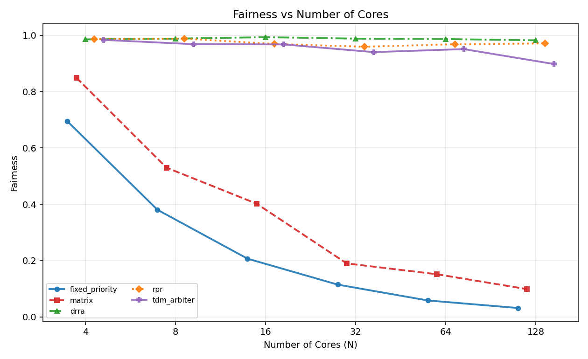
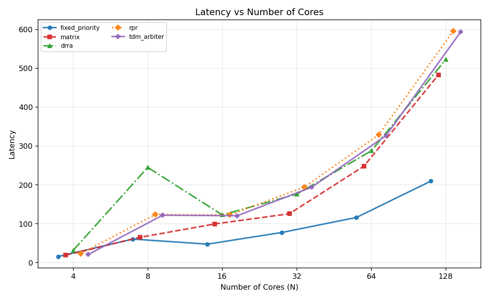
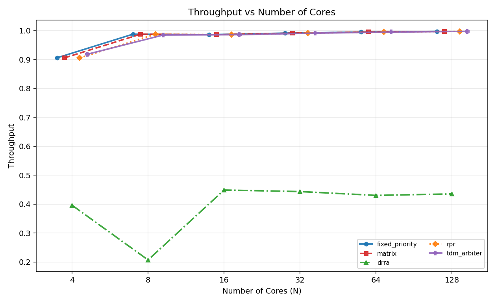
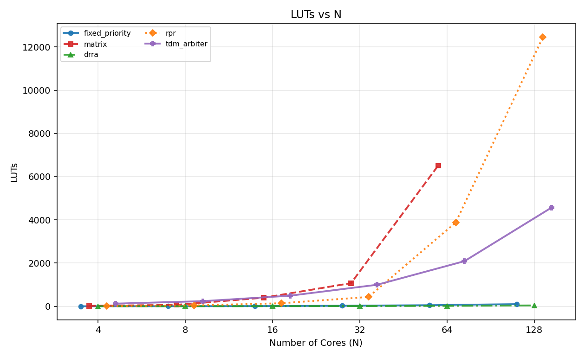
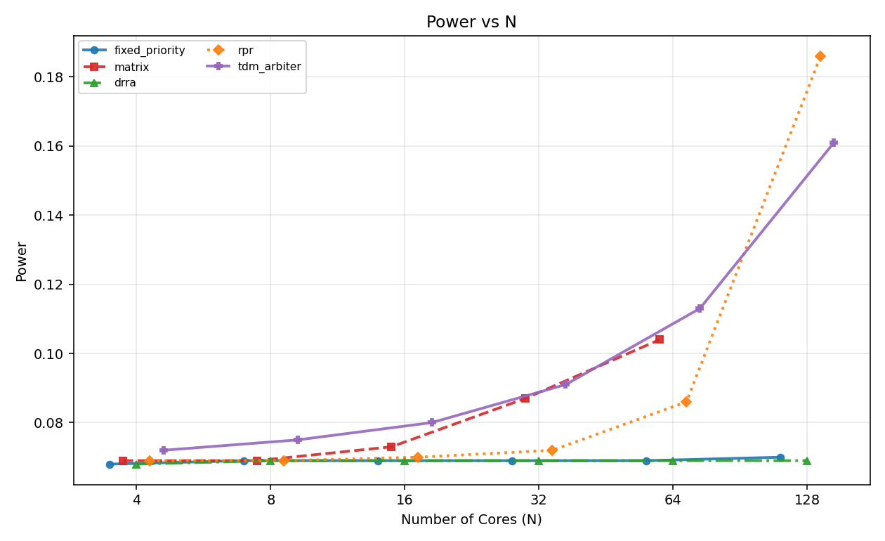
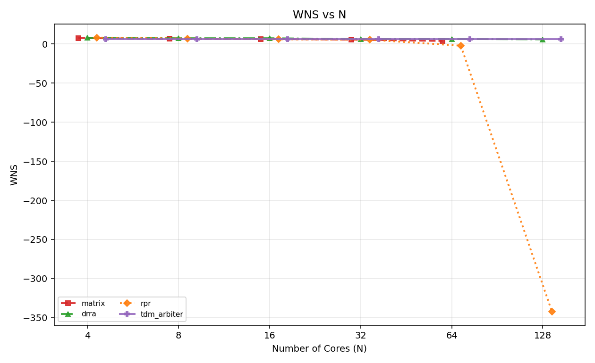

# Design and Analysis of Scalable Arbitration Algorithms

This repository compares arbitration strategies across scalable core counts:

- [drra](RoundRobinArbiter/README.md): Dynamic round-robin arbiter dataset
- [fixed_priority](fixed_priority/README.md): Fixed-priority arbiter
- [matrix](matrix/README.md): Matrix-based round-robin arbiter
- [round_robin](RoundRobinArbiter/README.md): RR variants (RRA modulo, RRA_RPR, DRRA)
- [rpr](RoundRobinArbiter/README.md): Rotate-priority-rotate variant
- [tdm_arbiter](TDM_Arbiter/README.md): Weighted/TDM-style arbiter

Core sizes analyzed: N = 4, 8, 16, 32, 64, 128.

## Project structure

- [Makefile](Makefile): root automation entry points
- [run_all_sims.bat](run_all_sims.bat): run simulation batches from Windows
- [analysis/](analysis/README.md): end-to-end parsing, metrics, EDA, and plotting pipeline
- [docs/](docs/report.txt): summary reports and notes
- [fixed_priority/](fixed_priority/README.md): fixed-priority RTL, testbench, simulation artifacts
- [matrix/](matrix/README.md): matrix arbiter RTL, testbench, simulation artifacts
- [RoundRobinArbiter/](RoundRobinArbiter/README.md): RR family variants (DRRA, RRA_RPR, modulo logic)
- [TDM_Arbiter/](TDM_Arbiter/README.md): TDM-style arbiter RTL, testbench, simulation artifacts
- [vivado/](vivado/README.md): synthesis TCL scripts and generated report directories

## Development lifecycle

This project was completed in the following order:

1. RTL design and coding of each arbiter module.
2. Testbench development and functional verification for each module.
3. Multi-N waveform simulation and VCD collection.
4. CSV parsing, metric computation, EDA checks, and behavior validation.
5. Vivado synthesis report generation and HW metric comparison.

## End-to-end flow

1. Complete RTL coding and testbench verification for each arbiter.
   - See [fixed_priority/](fixed_priority/README.md), [matrix/](matrix/README.md), [RoundRobinArbiter/](RoundRobinArbiter/README.md), [TDM_Arbiter/](TDM_Arbiter/README.md)
2. Generate VCD waveforms for all arbiters and N values.
   - See [fixed_priority/](fixed_priority/README.md), [matrix/](matrix/README.md), [RoundRobinArbiter/](RoundRobinArbiter/README.md), [TDM_Arbiter/](TDM_Arbiter/README.md) for simulation commands
3. Store VCDs in analysis/input_vcd/{arbiter}/N{N}/.
4. Parse waveforms, compute metrics, validate behavior.
   - See [analysis/README.md](analysis/README.md) for full pipeline
5. Generate plots comparing all arbiters across metrics.

## Quick start

Run full simulation + analysis on Windows:

```bat
run_all_sims.bat
```

Run analysis only (from project root):

```bat
cd analysis
python main.py
```

See [analysis/README.md](analysis/README.md) for detailed steps.

## Metrics and formulas

All metrics are computed after uniform downsampling so each arbiter at a given N uses the same number of rows.

Uniform datapoints per N:

- For each N, find minimum row count among arbiters.
- Use that count for every arbiter at that N.

Current minimum rows used:

| N | Min rows used |
|---|----------------|
| 4 | 954 |
| 8 | 4314 |
| 16 | 3810 |
| 32 | 6114 |
| 64 | 10722 |
| 128 | 19938 |

Throughput:

- granted_cycles / total_cycles

Fairness (Jain fairness index over grant distribution by requester):

$$J(x)=\frac{(\sum_i x_i)^2}{n\cdot\sum_i x_i^2}$$

where $x_i$ is grants received by requester $i$.

Latency (request-level queue latency):

- Each cycle with req[i]=1 increments pending queue for requester i.
- A valid one-hot grant for requester i serves one pending request.
- Per-request latency is pending age at service; reported latency is mean over served requests.

## Missing-data and quality handling

- curr_req and grant are forward-filled/back-filled per (arbiter, N).
- Rows still missing after fill are dropped.
- Invalid grants (non-zero and non-one-hot) are counted in EDA outputs.
- Sparse metric gaps are interpolated per arbiter and then ffill/bfill.

EDA outputs:

- analysis/parsed_csv/eda/data_quality_summary.csv
- analysis/parsed_csv/eda/group_summary.csv

## Output files

- analysis/parsed_csv/raw_signals/all_data.csv
- analysis/parsed_csv/raw_signals/uniform_data.csv
- analysis/parsed_csv/metrics/all_metrics.csv
- analysis/parsed_csv/hw_metrics/all_hw.csv
- analysis/parsed_csv/final_comparison.csv
- analysis/plots/*.png

## Hardware reports (Vivado)

Vivado reports are generated into:

- vivado/reports/{arbiter}/N{N}/utilization.rpt
- vivado/reports/{arbiter}/N{N}/power.rpt
- vivado/reports/{arbiter}/N{N}/timing.rpt

Parsed hardware metrics:

- LUTs (area)
- Power (W)
- WNS (ns)

### Current Vivado coverage note

- All requested missing reports were generated except `matrix/N128`.
- `matrix/N128` is intentionally omitted in current HW comparison because Vivado crashes during synthesis with `EXCEPTION_ACCESS_VIOLATION` in this environment.
- Crash artifacts recorded in [hs_err_pid4784.log](hs_err_pid4784.log) and [hs_err_pid4784.dmp](hs_err_pid4784.dmp).

See [vivado/README.md](vivado/README.md) for Vivado automation details.

## Latest result snapshot

### Functional metric table (fairness)

| Arbiter | N4 | N8 | N16 | N32 | N64 | N128 |
|---|---:|---:|---:|---:|---:|---:|
| drra | 0.985 | 0.988 | 0.993 | 0.988 | 0.986 | 0.982 |
| fixed_priority | 0.695 | 0.380 | 0.207 | 0.115 | 0.059 | 0.032 |
| matrix | 0.849 | 0.530 | 0.402 | 0.190 | 0.152 | 0.099 |
| round_robin | 0.994 | 0.994 | 0.957 | 0.950 | 0.938 | 0.954 |
| rpr | 0.986 | 0.988 | 0.969 | 0.959 | 0.968 | 0.971 |
| tdm_arbiter | 0.984 | 0.968 | 0.968 | 0.940 | 0.951 | 0.898 |

### Hardware table (LUTs / Power / WNS)

| Arbiter | N64 LUTs | N64 Power (W) | N64 WNS (ns) | N128 LUTs | N128 Power (W) | N128 WNS (ns) |
|---|---:|---:|---:|---:|---:|---:|
| drra | 22 | 0.069 | 6.346 | 40 | 0.069 | 5.907 |
| fixed_priority | 52 | 0.069 | NA | 101 | 0.070 | NA |
| matrix | 6517 | 0.104 | 3.902 | NA | NA | NA |
| rpr | 3878 | 0.086 | -2.131 | 12463 | 0.186 | -341.995 |
| tdm_arbiter | 2089 | 0.113 | 5.958 | 4572 | 0.161 | 5.958 |

### Plot gallery








### Analysis notes

1. Fixed-priority remains area-efficient, but fairness drops sharply with N, indicating starvation risk under sustained contention.
2. DRRA and RPR keep fairness near 1.0 across all N and preserve high throughput at larger N.
3. Matrix remains throughput-strong but fairness degrades with scale, and matrix N128 HW data is absent due Vivado crash.
4. TDM keeps fairness high in this workload and now has complete HW coverage at N32 and N64.
5. Plot overlap for close curves is now mitigated by consistent marker/linestyle mapping and small per-arbiter x-offsets to improve readability.

## Behavior sanity check reference

Observed trends are consistent with common scheduler behavior from standard references:

- Fixed priority can starve lower-priority requesters under persistent high-priority demand.
- Round-robin families are generally starvation-free and improve fairness.
- Weighted round-robin / TDMA family allocates service proportionally or by slot pattern.

Reference URLs used during validation:

- https://en.wikipedia.org/wiki/Round-robin_scheduling
- https://en.wikipedia.org/wiki/Weighted_round_robin
- https://en.wikipedia.org/wiki/Fixed-priority_pre-emptive_scheduling
- https://en.wikipedia.org/wiki/Time-division_multiple_access

---

## Navigation

**Jump to an arbiter README:**
- [fixed_priority](fixed_priority/README.md)
- [matrix](matrix/README.md)
- [RoundRobinArbiter variants](RoundRobinArbiter/README.md)
- [TDM_Arbiter](TDM_Arbiter/README.md)

**Analysis and metrics:**
- [analysis/ - Full pipeline documentation](analysis/README.md)
- [vivado/ - Vivado report generation](vivado/README.md)

